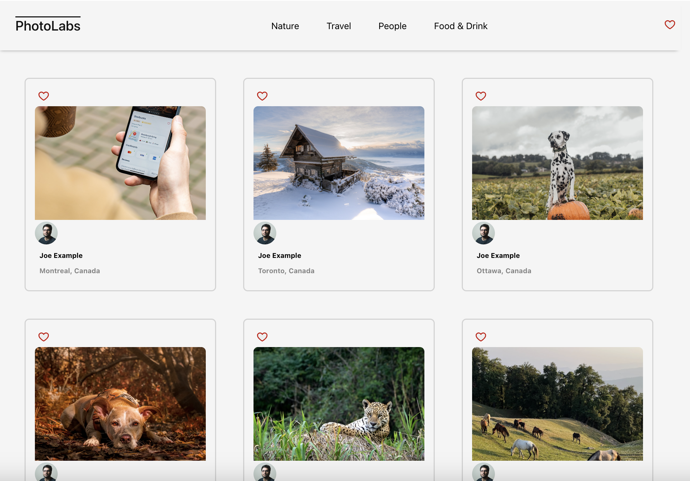
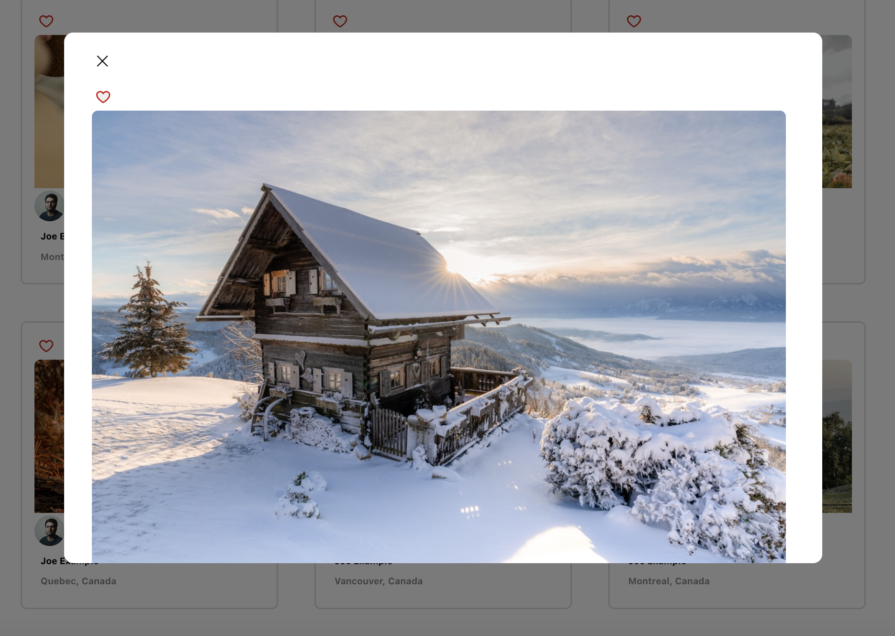

# react-photolabs
The PhotoLabs project for the Web Development Course - Introduction to React.

# Photolabs

## Setup Instructions:

Install dependencies with `npm install` in both the `/frontend` and the `/backend`.

## [Frontend] Running Webpack Development Server

```sh
cd frontend
npm start
```

## [Backend] Running Backend Server

Read `backend/readme` for further setup details.

```sh
cd backend
npm start
```




